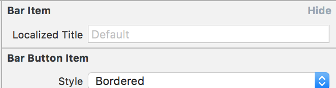
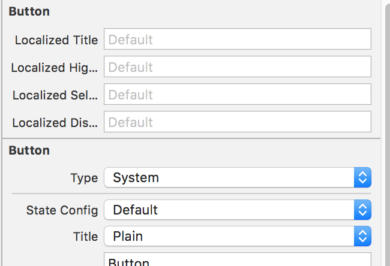
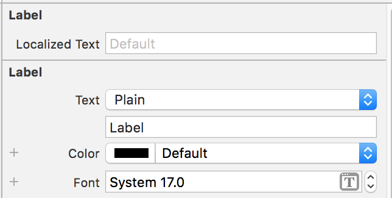
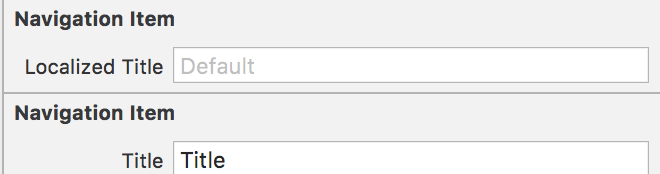
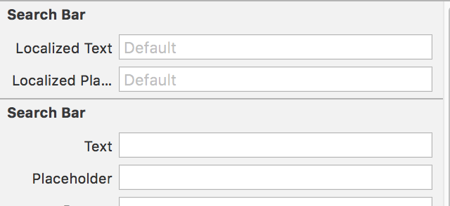
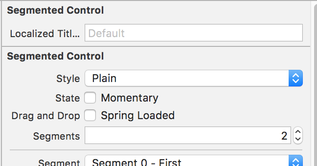
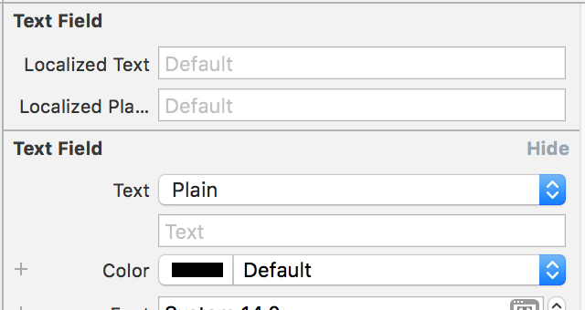
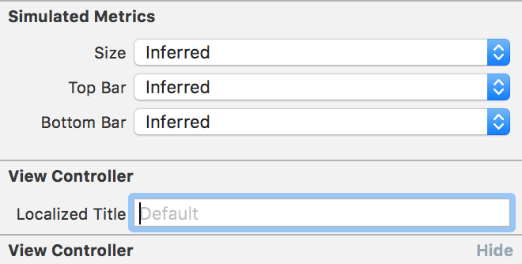

# UILocalizable

[](http://cocoapods.org/pods/UILocalizable)
[](http://cocoapods.org/pods/UILocalizable)


</img>

</img>

</img>

</img>

</img>

</img>

</img>

</img>

## Example

To run the example project, clone the repo, and run `pod install` from the Example directory first.

## Requirements

## Installation

UILocalizable is available through [CocoaPods](http://cocoapods.org). To install
it, simply add the following line to your Podfile:

```ruby
pod 'UILocalizable'
```

## Author

Dani Manuel Céspedes Lara, dmanuelcl@gmail.com

## License

UILocalizable is available under the MIT license. See the LICENSE file for more info.
